  <picture>
    <source media="(prefers-color-scheme: dark)" srcset="./dark.svg">
    <source media="(prefers-color-scheme: light)" srcset="./light.svg">
    
  </picture>

### Hi there 👋

Welcome to my GitHub profile! I'm a passionate developer focusing on building scalable applications and learning new technologies.

- 🔭 I’m currently working on open-source projects
- 🌱 I’m currently learning advanced web architectures
- 💬 Ask me about React, Node.js, and Python
- ⚡ Fun fact: I love to automate everything!

 
 

  <i>The header above is 100% SVG generated with SMIL animations!</i>

